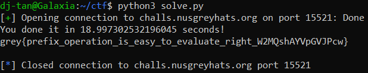

# Calculator

**Category:** Misc<br>
**Difficulty:** Medium<br>
**Points:** 50

## Challenge Description

Calculator is a nice invention

## Analysis

Connect to the server using netcat `nc challs.nusgreyhats.org 15521`


Right off the bat, notice that we are made to solve 100 math questions in 30 seconds to get the flag. Clearly, the majority of us (or possibly all of us) will find it impossible to solve and submit 100 consecutive math problems in three-tenths of a second. This calls for the use of **pwntools** to read the line and use a program to run the calculation for us.

Moving on to the operations and examples, we can note the following:<br>
1. Read the sentence from left to right
2. An operation is carried out if:
    * An `add`, `mul`, or `sub` operation is proceeded by 2 integers
    * An `inc` or `neg` operation is proceeded by 1 integer
3. Any operations carried out will result in 1 integer, which is substituted back into the sentence (eg. substitute `add 1 2` with `3` )
4. Once the last element has been reached, check if there is only 1 integer left in the sentence. Otherwise, repeat from Step 1 with the new sentence.

## Solution

```python
from pwn import *

def calculate(input):

    operator_list = ["add", "mul", "sub", "neg", "inc"]
    arr = input.split(" ")
    i = 0

    while len(arr) != 1:
            if arr[i] == "add":
                if arr[i + 1] not in operator_list and arr[i + 2] not in operator_list:
                    arr.insert(i,str(int(arr[i + 1]) + int(arr[i + 2])))
                    del arr[i+1]
                    del arr[i+1]
                    del arr[i+1]
                    if arr[i-1] not in operator_list:
                        i -= 2
                    else:
                        i -= 1
                else:
                    i += 1

            elif arr[i] == "sub":
                if arr[i + 1] not in operator_list and arr[i + 2] not in operator_list:
                    arr.insert(i,str(int(arr[i + 1]) - int(arr[i + 2])))
                    del arr[i+1]
                    del arr[i+1]
                    del arr[i+1]
                    if arr[i-1] not in operator_list:
                        i -= 2
                    else:
                        i -= 1
                else:
                    i+=1

            elif arr[i] == "mul":
                if arr[i + 1] not in operator_list and arr[i + 2] not in operator_list:
                    arr.insert(i,str(int(arr[i + 1]) * int(arr[i + 2])))
                    del arr[i+1]
                    del arr[i+1]
                    del arr[i+1]
                    if arr[i-1] not in operator_list:
                        i -= 2
                    else:
                        i -= 1
                else:
                    i+=1

            elif arr[i] == "neg":
                if arr[i + 1] not in operator_list:
                    arr.insert(i,str(int(arr[i + 1]) * -1))
                    del arr[i+1]
                    del arr[i+1]
                    if arr[i-1] not in operator_list:
                        i -= 2
                    else:
                        i -= 1
                else:
                    i+=1
                    
            elif arr[i] == "inc":
                if arr[i + 1] not in operator_list:
                    arr.insert(i,str(int(arr[i + 1]) + 1))
                    del arr[i+1]
                    del arr[i+1]
                    if arr[i-1] not in operator_list:
                        i -= 2
                    else:
                        i -= 1
                else: 
                    i += 1
            else:
                i = i + 1

    return arr[0]

if __name__ == "__main__":

    p = remote('challs.nusgreyhats.org', 15521)

    p.recvuntil(b'ready!\n')
    p.sendline(b'START')
    
    for i in range(100):
        
        input = p.recvline().decode("UTF-8")
        output = calculate(input).encode("UTF-8")
        p.sendline(output)
        x = p.recvuntil(b'right!\n')
    
    print(p.recv().decode("UTF-8"))

```

The output of running this Python script is as follows:



`Flag: grey{prefix_operation_is_easy_to_evaluate_right_W2MQshAYVpGVJPcw}`