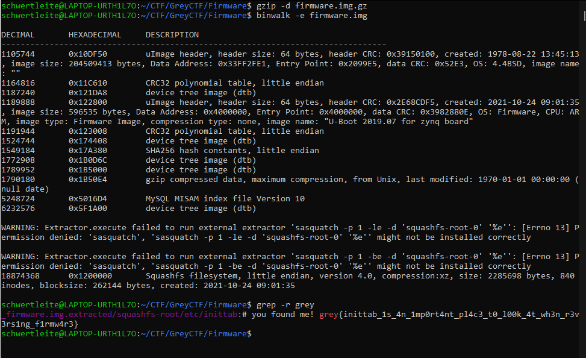

# Firmware

**Category:** Misc 
**Difficulty:** Easy 🍭 
**Points:** 50

## Challenge Description

Router firmware is a nice target to start your bug hunting journey. But you have to first understand how the firmware is loaded.

There is always a file in the firmware image that tells the router what services to start. Find this file.

## Solution

This is a fairly simple problem with only 3 commands required to get the flag:
1. `gzip -d firmware.img.gz` to unzip the file
2. `binwalk -e firmware.img` to extract the firmware images
3. `grep -r "grey"` to recursively search the directory for the flag

`Flag: grey{inittab_1s_4n_1mp0rt4nt_pl4c3_t0_l00k_4t_wh3n_r3v3rs1ng_f1rmw4r3}`
