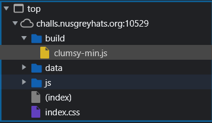

# flappy-js

**Category:** Reverse Engineering<br>
**Difficulty:** Easy 🍭<br>
**Points:** 50

## Challenge Description

Are you a pro gamer? Can you get a score of 31337 in this game?

(flag format is greyctf{...} because I made a mistake :p)

## Analysis

Not again, the pixelated flying bird is here to cause pain and misery. And what is this, a score of 31337? No way I'm doing that mate. Perhaps there is something we can exploit in the source code.

## Solution



Inspect element to view the source code. Of particular interest is the file named `clumsy-min.js`. Using a [JavaScript beautifier](https://beautifier.io/) can help make the code more readable. Next, run a filter using the keyword `flag`, which happens to net us an interesting function named `genFlag()`. Perhaps this can be used to generate the flag.

Copy the function into a .js file and execute the code to print the flag. To solve the error stating that `atob is not defined`, simply create a function to define the `atob` function manually. The cause of the error is described [here](https://eloquentcode.com/base64-encode-and-decode-in-node-js).

As the mentioned in the challenge description, the author had forgot to wrap the flag in the format `grey{...}`. Hence, the output message was modified to factor in this shortcoming.

```js
function atob(base64string) {
    return Buffer.from(base64string, 'base64').toString('utf-8')
}

var a = "AzhkZTRlYB0GDT0NAhItAQw4LR4DEzkABjkbAwM5DywDOCFlAhIfEgY5DwMDZgQiAxETNDZkGyYPEzEbAz4lDAIDDz4HZWAmAjsfPAc5Dw0DPx87MDkxAg8RBz4YEQMsAQMDAjQSAyQEAT5o";
a = atob(a);
var b = "";
for (var c in a) b += String.fromCharCode(85 ^ a.charCodeAt(c));
b = b.substring(0, b.indexOf("=") + 1), b = atob(b), b = atob(b), b = atob(b), b = atob(b), b = atob(b), b = atob(b)
console.log("grey{" + b + "}")
```

`Flag: grey{5uch_4_pr0_g4m3r}`
