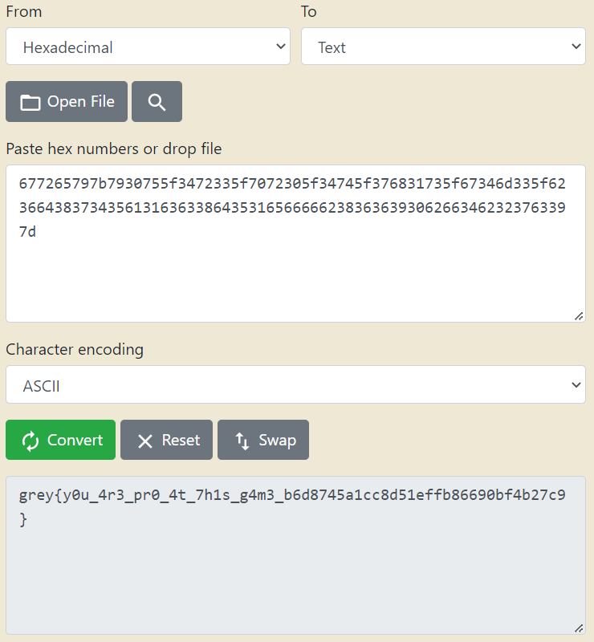

# flappy-o

**Category:** Reverse Engineering<br>
**Difficulty:** Medium<br>
**Points:** TBD

## Challenge Description

I know you cheated in flappy-js. This time the game is written in C, I don't think you can cheat so easily. Or can you?

Show me your skills by getting a score of at least 64.

*HINT: Consider [patching](https://www.youtube.com/watch?v=8U6JOQnOOkg).*

## Analysis

To be perfectly honest, we initially solved this challenge by playing the game out to a score of 64 and obtaining the flag that way. The game really isn't that hard once you get the hang of it. Just care for the painful finger cramps from the multiple spacebar presses. 🤕

Nevertheless, in typical CTF fashion, we wanted to find a way to solve it for the people who are just bad at flappybird (sorry but no sorry). As per usual, fire up **Ghidra** to disassemble the binary. After a bit of poking around, we found a particular snippet of code from the `updateAndDrawFlag()` function quite interesting.

**Code Snippet 1: updateAndDrawFlag**
```c
if (score < 0x40) {
    flagChar = genFlag1(score - 1);
    flag1[(int)(score - 1)] = flagChar;
}
```
The if-condition for `score < 0x40` perfectly lines up with the challenge description of getting a score of at least 64 (0x40 = 64). We can infer that every point we get towards a score of 64 will get us one character of the flag. In addition, notice that `genFlag1()` uses the current score value to generate this flag character.

**Code Snippet 2: genFlag1**
```c
char genFlag1(int n)
{
    byte bVar1;
    ushort uVar2;
  
    bVar1 = key1[n];
    uVar2 = lfsr1(n);
    return (byte)uVar2 ^ bVar1;
}
```
The code here shows that the flag character is generated by XORing a value from `key1` and a value obtained from `lfsr1()`.

**Code Snippet 3: lfsr1**
```c
ushort lfsr1(int n)
{
    uint uVar1;
    int i;
    int seed;
    int lsb;
  
    seed = 0xabcd;
    for (i = 0; i < n; i = i + 1) {
        uVar1 = seed & 1;
        seed = seed >> 1;
        if (uVar1 != 0) {
            seed = seed ^ 0x82ee;
        }
    }
    return (ushort)seed;
}
```
The code here performs some form of linear shifting using the predefined `seed` and the value obtained from `score`.

**Code Snippet 4: key1**
```c
                             key1                                            XREF[3]:     Entry Point (*) , 
                                                                                          genFlag1:001026f4 (*) , 
                                                                                          genFlag1:001026fb (R)   
        00105040 aa  7a  e1       uchar[64]  AAh,"z",E1h,BBh,9Ah,E7h,FFh,"|5",01h,06h,"\t",
                 bb  9a  e7 
                 ff  7c  35 
           00105040 [0]            AAh,  'z',  E1h,  BBh
           00105044 [4]            9Ah,  E7h,  FFh,  '|'
           00105048 [8]            '5',  01h,  06h, '\t'
           0010504c [12]           C2h,  'P',  'b',  '8'
           00105050 [16]           DBh,  'v',  D5h,  E1h
           00105054 [20]           'h',  A9h,  BFh,  B4h
           00105058 [24]           'R',  8Fh,  C0h,  17h
           0010505c [28]           0Eh,  '/',  DAh,  EAh
           00105060 [32]           8Ah,  CFh,  A2h,  90h
           00105064 [36]           E7h, '\b',  EBh,  0Eh
           00105068 [40]           ';',  14h,  'r',  BEh
           0010506c [44]           9Ah,  DEh,  D5h,  'Q'
           00105070 [48]           97h,  ',',  BCh,  F3h
           00105074 [52]           '5',  B6h,  '!',  ')'
           00105078 [56]           '}',  A8h,  D7h,  '+'
           0010507c [60]           EDh,  FEh,  F0h, '\0'

```
Here, we extracted out the value of key1 that was present in Code Snippet 2.

## Solution

Putting everything together, we are now able to generate the flag without having to play the game at all (sorry [@daniellimws](https://github.com/daniellimws)). The above code snippet were copied and compiled into an executable to generate the hex representation of the flag.

```c
#include <stdio.h>
#include <inttypes.h>

typedef uint8_t byte;
unsigned char g_flagChar;
unsigned char key1[64] = {0xAA, 'z', 0xE1, 0xBB, 0x9A, 0xE7, 0xFF, '|',
 '5', 0x01, 0x06, '\t', 0xC2, 'P', 'b', '8',
  0xDB, 'v', 0xD5, 0xE1, 'h', 0xA9, 0xBF, 0xB4, 
  'R', 0x8F, 0xC0, 0x17, 0x0E, '/', 0xDA, 0xEA,
  0x8A, 0xCF, 0xA2, 0x90, 0xE7, '\b', 0xEB, 0x0E, 
  ';', 0x14, 'r', 0xBE, 0x9A, 0xDE, 0xD5, 'Q', 
  0x97, ',', 0xBC, 0xF3, '5', 0xB6, '!', ')',
  '}', 0xA8, 0xD7, '+', 0xED, 0xFE, 0xF0, '\0'};

char genFlag1(int n);
unsigned short lfsr1(int n);

int main(void) 
{    
    for (unsigned int i = 0; i < 0x40; i++) {
        g_flagChar = genFlag1(i - 1);
        printf("%hhx", g_flagChar);
    }
}

char genFlag1(int n) 
{
    byte bVar1;
    unsigned short uVar2;
  
    bVar1 = key1[n];
    uVar2 = lfsr1(n);
    return (byte)uVar2 ^ bVar1;
}

unsigned short lfsr1(int n) 
{
    unsigned int uVar1;
    int i;
    int seed;
    int lsb;
  
    seed = 0xabcd;
    for (i = 0; i < n; i = i + 1) {
        uVar1 = seed & 1;
        seed = seed >> 1;
        if (uVar1 != 0) {
            seed = seed ^ 0x82ee;
    }
  }
  return (unsigned short)seed;
}
```

**Result:** cd677265797b7930755f3472335f7072305f34745f376831735f67346d335f62366438373435613163633864353165666662383636393062663462323763397d

We proceeded to use an online [hex to text converter](https://www.rapidtables.com/convert/number/hex-to-ascii.html) to get the flag.



`Flag: grey{y0u_4r3_pr0_4t_7h1s_g4m3_b6d8745a1cc8d51effb86690bf4b27c9}`
