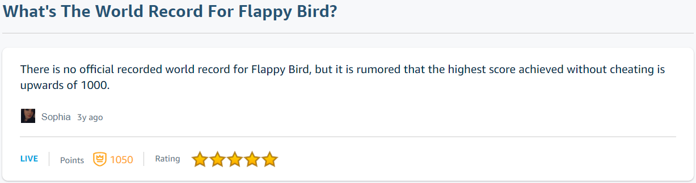

# flappy-o2

**Category:** Reverse Engineering<br>
**Difficulty:** Hard 🩸<br>
**Points:** TBD

## Challenge Description

This challenge uses the same binary as flappy-o.

Every 10000 points you reach, you unlock a character of the bonus flag. This is the real test of your skills.

## Analysis

The challenge description states that one character of the bonus flag will be printed every 10000 points. Let's do a quick check on the highest score ever achieved on the original flappybird game...



**UPWARDS OF 1000?!?!** Surely the creator of this challenge doesn't expect us to spend the next devote the next decade of our lives to this knockoff flappybird game (no offense). Perhaps we can get some clues by analysing the binary itself.

As per usual, fire up **Ghidra** to disassemble the binary. After a bit of poking around, we found a particular snippet of code from the `updateAndDrawFlag()` function quite interesting.

**Code Snippet 1: updateAndDrawFlag**
```c
lfsr2(1);
uVar1 = uVar3;
if (((int)uVar3 % 10000 == 0) && ((uint)((int)uVar3 / 10000) < 0x1a)) {
    iVar4 = genFlag2(uVar3 - 10000);
    (&DAT_001052dc)[(int)uVar3 / 10000] = iVar4;
}
```
As expected, there is an if condition that gets called 25 times (0x1a = 26) for `uVar3` in {0, 10000, 20000, ... , 250000}. Following which, `uVar3` is used to generate the bonus flag character `iVar4` and saved into an array.

**Code Snippet 2: genFlag2**
```c
int genFlag2(int i)
{
  ushort uVar1;
  uint uVar2;
  
  uVar1 = lfsr1(i);
  uVar2 = lfsr2((uint)uVar1);
  return key2[i / 10000] ^ uVar2;
}
```
In the `genFlag2()` function, we don't get much information except that `uVar3` from Code Snippet 1 is used to generate `uVar1`, which in turn generates `uVar2`. `uVar2` is then XORed with `key2` to get the character `iVar4`.

**Code Snippet 3: lfsr1**
```c
ushort lfsr1(int n)
{
  uint uVar1;
  int i;
  int seed;
  int lsb;
  
  seed = 0xabcd;
  for (i = 0; i < n; i = i + 1) {
    uVar1 = seed & 1;
    seed = seed >> 1;
    if (uVar1 != 0) {
      seed = seed ^ 0x82ee;
    }
  }
  return (ushort)seed;
}
```
In `lfsr1`(), it would appear that a seed is being generated using 'uVar3' from Code Snippet 1. All variables and constants appear to be defined clearly in this function, so we shall not further explain what happens here.

**Code Snippet 4: lfsr2**
```c
uint lfsr2(int n)
{
  uint uVar1;
  int i;
  int lsb;
  
  for (i = 0; i < n; i = i + 1) {
    uVar1 = lfsr2_seed & 1;
    lfsr2_seed = lfsr2_seed >> 1;
    if (uVar1 != 0) {
      lfsr2_seed = lfsr2_seed ^ 0x80000dd7;
    }
  }
  return lfsr2_seed;
}
```
In `lfsr2()`, the code is very similar to `lfsr1()`, except that the value of `lfsr2_seed` is nowhere to be found here. Well, that just means more poking around in other parts of the binary.

**Code Snippet 5: key2**
```
                             key2                                            XREF[3]:     Entry Point (*) , 
                                                                                          genFlag2:0010275e (*) , 
                                                                                          genFlag2:00102765 (R)   
        00105080 eb  42  aa       uint[25]
                 7c  a8  fd 
                 53  cd  57 
           00105080 [0]               7CAA42EBh,     CD53FDA8h,     F7420557h,     5267EEC4h
           00105090 [4]               793E70EDh,     68D1AEC0h,     38DA23EBh,     6F1D6FB1h
           001050a0 [8]               39489B7Bh,     F4F87516h,     ED67BC18h,     8AD36BA0h
           001050b0 [12]              AF2A684Fh,     80883171h,     86CE7D28h,     438CB016h
           001050c0 [16]              5784988Ch,     4BB5278Bh,     BFDCD0C6h,     6DDA7789h
           001050d0 [20]              B0F09AA3h,     557478BEh,     C372AEE8h,     40A28470h
           001050e0 [24]              A855383Ah

```
Here, we have the value of `key2` that was not shown in Code Snippet 2.

**Code Snippet 6: lfsr2_seed**
```
                             lfsr2_seed                                      XREF[7]:     Entry Point (*) , 
                                                                                          lfsr2:001026a0 (R) , 
                                                                                          lfsr2:001026ac (R) , 
                                                                                          lfsr2:001026b4 (W) , 
                                                                                          lfsr2:001026c0 (R) , 
                                                                                          lfsr2:001026cb (W) , 
                                                                                          lfsr2:001026d7 (R)   
        001050e4 4d  3c  2b  1a    int        1A2B3C4Dh                                        flappybird.cpp:390

```
And here, we have the value of `lfsr2_seed` that was not shown in Code Snippet 4.

## Solution

With everything in place, it is now possible to generate the bonus flag without having to slog away at the game. Whew!

```c
#include <stdio.h>

unsigned int key2[25] = {2091533035, 3444833704, 4148299095, 1382543044, 2034135277, 1758572224, 953820139, 1864200113, 961059707, 4109923606, 3982998552, 2329111456, 2938792015, 2156409201, 2261679400, 1133293590, 1468307596, 1270163339, 3218919622, 1843033993, 2968558243, 1433696446, 3279073000, 1084392560, 2824157242};
int lfsr2_seed = 439041101;

unsigned short int lfsr1(int n)
{
  unsigned int uVar1;
  int i;
  int seed;
  int lsb;
  
  seed = 0xabcd;
  for (i = 0; i < n; i = i + 1) {
    uVar1 = seed & 1;
    seed = seed >> 1;
    if (uVar1 != 0) {
      seed = seed ^ 0x82ee;
    }
  }
  return (unsigned short int)seed;
}

unsigned int lfsr2(int n)

{
  unsigned int uVar1;
  int i;
  int lsb;
  
  for (i = 0; i < n; i = i + 1) {
    uVar1 = lfsr2_seed & 1;
    lfsr2_seed = lfsr2_seed >> 1;
    if (uVar1 != 0) {
      lfsr2_seed = lfsr2_seed ^ 0x80000dd7;
    }
  }
  return lfsr2_seed;
}

int genFlag2(int i)

{
  unsigned short uVar1;
  unsigned int uVar2;
  
  uVar1 = lfsr1(i);
  uVar2 = lfsr2((unsigned int)uVar1);
  return key2[i/10000] ^ uVar2;
}

int main(void) 
{
    printf("Start\n");
    for (int i = 1; i <= 250000; i += 1) {
        lfsr2(1);
        if (i % 10000 == 0) {
          printf("%u\n", genFlag2(i-10000));
        }
    }
}
```

The c code above was used to generate 25 numbers, with each number corresponding to 4 characters of the flag. The 25 numbers were then sent through the following python code to convert them into bytes and print out the flag.

```python
from Crypto.Util.number import long_to_bytes, bytes_to_long

vals = [2036691559, 1966111099, 863122527, 1915975263, 812081017, 
878666800, 1748459380, 1734308657, 1597205812, 1601057891,
1601515641, 1664365428, 862805864, 1999661151, 1597011039,
1734292322, 1600401456, 1647601253, 842543716, 845231972,
1697735265, 1667458146, 909194803, 929391204, 2103600737]

output = ''
for val in vals:
    output += (long_to_bytes(val).decode('utf-8')[::-1])
    
print(output)
```

`Flag: grey{y0u_4r3_v3ry_g00d_4t_7h1s_g4m3_c4n_y0u_t34ch_m3_h0w_t0_b3_g00d_ef4bd282d7a2ab1ebdcc3616dbe7afb}`
