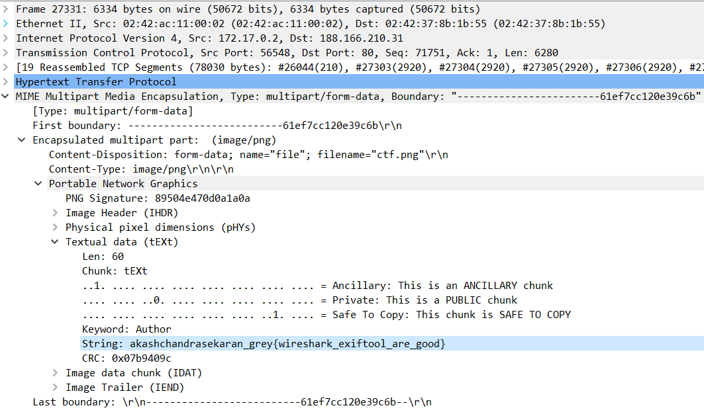

# Ghost

**Category:** Misc 
**Difficulty:** Easy 🭠
**Points:** 50

## Challenge Description

HTTP is not secure. Inspect this packet dump and you will know why.

Find the packet related to an image upload and extract the image. Then, find the name of the creator of this image.

## Analysis

Oh look! It's a packet capture file. We shall use [Wireshark](https://www.wireshark.org/) to inspect this packet dump. 

## Solution

The challenge description states that 'HTTP is not secure'. Hence, it is likely that we should inspect packets using the HTTP protocol. (Use the display filter to filter find the relevant packets)

We are asked to extract an image. Hence, open the packet that `POST` a PNG file. The flag can be found as a string in information about the `MIME Multipart Media Encapsulation > Encapsulated multipart part > Portable Network Graphics > Textual data > String`

`Flag: grey{wireshark_exiftool_are_good}`
