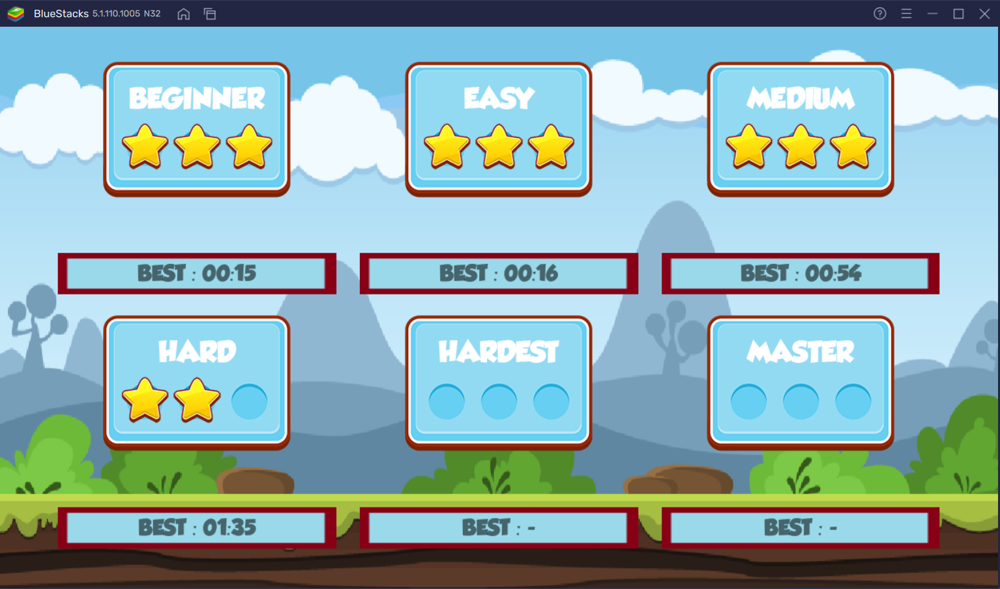
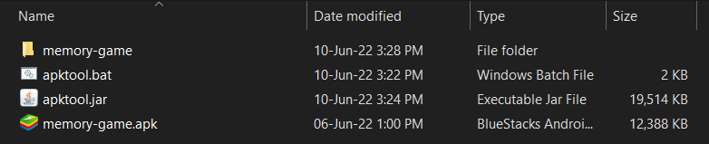
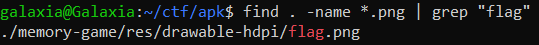
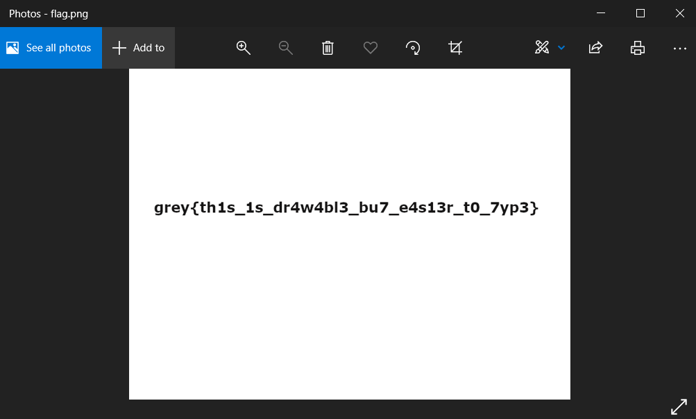

# Memory Game (Part 1)

**Category:** Reverse Engineering 
**Difficulty:** Easy 🍭 
**Points:** 50

## Challenge Description

Here's a fun game to destress.

Do you know where the image assets are stored? I've made a nice drawing for you.

## Analysis

Let's preface this writeup by saying that this solution is probably not the most efficient way to solve this problem. However, the tools downloaded here will be useful in solving Memory Game (Part 2) later on.

We are given a pretty fun card matching memory game to play around with (much appreciated thanks 😊). Just so that the game's creator know that his/her game did not go to waste, here's a screenshot of us completing a few levels (pardon the 2 star stage - I'm bad).

Okay for reals now. We decided to download and use [Apktool](https://ibotpeaches.github.io/Apktool/) to decompile the .apk file. Step-by-step instructions on how to download and use the tool can be found [here](https://www.wikihow.com/Edit-APK-Files). If the instructions were followed correctly, you should end up with a folder with the items as shown in the figure below.

## Solution

The challenge description hinted that the flag is a "nice drawing", which we can infer that the flag is in an image file as opposed to being stored as a string. Hence, we shall intuitively check for PNG files with flag in its name. Alternatively, the term "drawing" also hints that the target image file might be in the `drawable` directory.

Command: `find . -name *.png | grep "flag"`

Looks like there is indeed a flag.png file in the `drawable-hdpi` directory. Navigate there and open up the file to find the flag.

`Flag: grey{th1s_1s_dr4w4bl3_bu7_e4s13r_t0_7yp3}`
