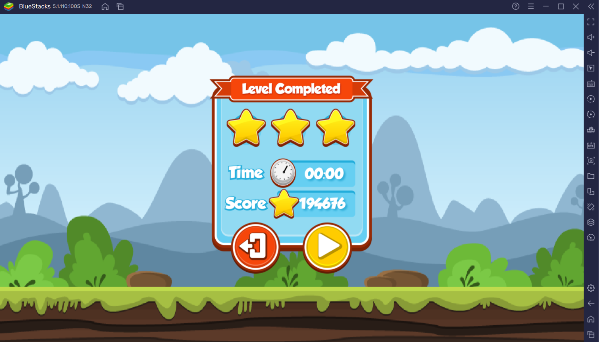

# Memory Game (Part 2)

**Category:** Reverse Engineering 
**Difficulty:** Hard 🩸 
**Points:** 423

## Challenge Description

Can you finish MASTER difficulty in 20 seconds? If you can, the flag will be given to you through logcat with the tag FLAG.

## Hint

[Frida](https://www.youtube.com/watch?v=iMNs8YAy6pk) is nice.

## Solution

**Part 1: Decompiling and Reassembling**

It is IMPOSSIBLE to solve MASTER difficulty in 20 seconds. Just flipping a pair of cards takes so much time that even a perfect game would take more than 20 seconds. The hint suggested using Frida to hack the Android app. However, our solution involved taking apart the Android app using [APKtool](https://ibotpeaches.github.io/Apktool/), increasing the time for the MASTER difficulty stage, and playing the dummified game at our own pace.

The step-by-step setup of APKtool can be found [here](https://www.wikihow.com/Edit-APK-Files). For now complete the steps of Part 1: Installing APKTool, and Part 2: Decompiling and Editing. If everything was done correctly, the apk directory should look something like the image below:

However, we now face a problem. The files are in the Smali, which is an assembly language used by Android's Java VM implementation. Hence, we used another tool [JADX GUI](https://github.com/skylot/jadx/releases) to view the disassembled code in Java. After poking around a bit, we found the line of code that controls the amount of time for the MASTER difficulty level. From here, the goal was to modify this time value to increase it, and play the game itself to obtain the flag.

In the Smali files, we navigated to the directory containing the file `BoardConfiguration.smali` and changed the time value from 0x14 (20) to 0x7fff (32767). This should give us more than enough time to complete the game. After which, we continued with Part 3 of the [same guide](https://www.wikihow.com/Edit-APK-Files) to recompile the APK. 

**Part 2: Playing the Game**

we are told that the flag will be given through Logcat, hence Android Studio was used, with Bluestacks being the emulator to play the game on. Refer [here](https://www.devopsschool.com/blog/how-to-use-bluestacks-as-emulator-in-android-studio/) to see how to setup Bluestacks as an emulator in Android Studio.

Now, you see us in the middle of the game with an obscene amount of time to complete the level, as well as the score screen afterwards.

With the level cleared, we look to Logcat with the keyword 'grey' filtered out to find the flag.

`Flag: grey{hum4n_m3m0ry_i5_4lw4y5_b3tt3r_th4n_r4nd0m_4cc3ss_m3m0ry}`
