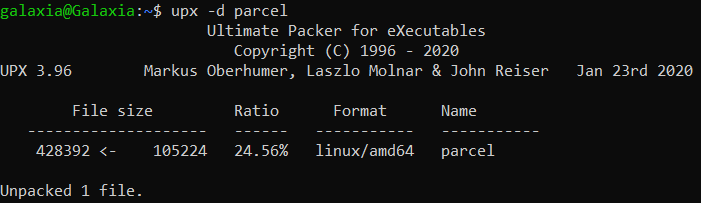
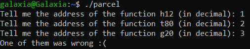
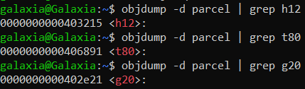
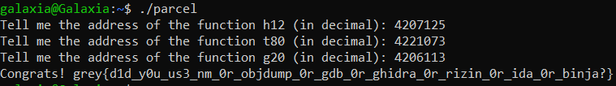

# Parcel

**Category:** Reverse Engineering 
**Difficulty:** Easy 🍭 
**Points:** 50

## Challenge Description

The binary is packed. Try to decompile it and you will find unreadable code.

Find out how it is packed and unpack it to recover the original binary.

## Hint
Run strings on the binary. There are some interesting strings in there.

## Analysis

The challenge description gives us a rough idea of the following steps we should take to solve this problem:
1. Find out how the binary is packed
2. Unpack the binary
3. Decompile the code to find relevant information
4. Execute the original binary with the gathered information

## Solution

**Step 1: Find out how the binary is packed**

The hint suggests that there may be strings in the binary related to how the binary was packed. 
Command: `strings parcel | grep "pack"` 
Output: `$Info: This file is packed with the UPX executable packer http://upx.sf.net $` 
From this, we determine that the file was packed using UPX (Ultimate Packer for Executables).

**Step 2: Unpack the binary**

If the "upx" package is yet to be installed, use the following commands:
1. `sudo apt-get update -y`
2. `sudo apt-get install -y upx`

Next run the unpack command: `upx -d parcel`

**Step 3: Run the binary and see what is required**

Execute the following commands to change file permissions and run it:
1. `sudo chmod +x parcel`
2. `./parcel`

It would appear that we need to find the addresses of 3 functions: h12, t80, and g20.

**Step 4: Find the functions' addresses**

Use **objdump** to display the function addresses within parcel:
1. `objdump -d parcel | grep h12`
2. `objdump -d parcel | grep t80`
3. `objdump -d parcel | grep g20`

`h12` address: 0x403215 = 4207125
`t80` address: 0x406891 = 4221073
`g20` address: 0x402e21 = 4206113

**Step 5: Run the binary again with the correct addresses**

Run command: `./parcel`

`Flag: grey{d1d_y0u_us3_nm_0r_objdump_0r_gdb_0r_ghidra_0r_rizin_0r_ida_0r_binja?}`
