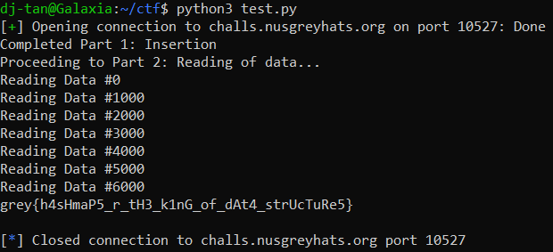

# Slow Down

**Category:** Misc<br>
**Difficulty:** Hard 🩸<br>
**Points:** 346

## Challenge Description

Sometimes, we just need to slow down and chill.

## Analysis

Refer to the following code sections in `chall.cpp`

**Objective**: Slow down the code as much as possible to get the timer over 5 seconds.

```cpp
if (time > 5.0) {
    cout << flag << endl;
    return 1;
}
```


**Case 0**: Time is incurred during the insertion process.<br>
Since a hashmap is used, incurred time can be increased if there are plenty of collisions during the insertion. However, our team decided that time incurred here is almost negligable so we did not exploit this feature.

```cpp
case 0:
    long long id; int amount;
    cin >> id >> amount;
    if (count == LIMIT) {
        cout << "This is too much..." << endl;
        break;
    }
    count++;

    begin = clock();
    map[id] = amount;
    time += (double) (clock() - begin) / CLOCKS_PER_SEC;

    break;
```

**Case 1**: Time is incurred during the query process.<br>
Notice that the for loop iterates through every item in the hashmap and proceeds to sum them up. This means that the more items in the map, the longer it would take to sum up the values. However, we have to consider that we can call each case a total of 25000 times, leading to a balancing game of number of items in the hashmap vs number of times sum is called.

```cpp
case 1:
    sum = 0;

    begin = clock();
    for (auto &item : map) {
        sum += item.second;
    }
    time += (double) (clock() - begin) / CLOCKS_PER_SEC;

    cout << "The total amount is " << sum << endl;

    break;
```

## Solution

We used a guess-and-check approach for this problem. Initially, we started by allocating 12500 iterations to case 0, 12499 iterations to case 1, and 1 iteration to case 2 for checking of the incurred time. After multiple tries, we found that the combination of **[17000, 7999, 1]** for cases [0, 1, 2] yielded the best result of 4.54 seconds. Clearly, something else needs to change to break the ceiling and go over 5 seconds.

**Idea**: Randomise the id during the insertion into the hashmap<br>
The intention of randomisation was to slow down the process where each element was queried from the array, and it so happened to work! 😂

```python
from pwn import *
from random import randint
from Crypto.Util.number import long_to_bytes

max = 0
case1 = 17000
case2 = 25000 - case1 - 1

p = remote('challs.nusgreyhats.org', 10527)
p.recvuntil(b'slow\n')

for i in range(case1):
    
    p.sendline(b'0')
    p.sendline(str(max).encode('utf-8') + b' ' + str(i).encode('utf-8'))
    max = max + randint(0, 5000)

print("Completed Part 1: Insertion")
print("Proceeding to Part 2: Reading of data...")

for i in range(case2):

    p.sendline(b'1')
    msg = p.recvline()
    if "grey" in msg.decode('utf-8'):
        print(msg.decode('utf-8'))
        p.close()
        break
    
    if i % 1000 == 0:
        print("Reading Data #" + str(i))
```

Running the code, the following result is obtained:



`Flag: grey{h4sHmaP5_r_tH3_k1nG_of_dAt4_strUcTuRe5}`
